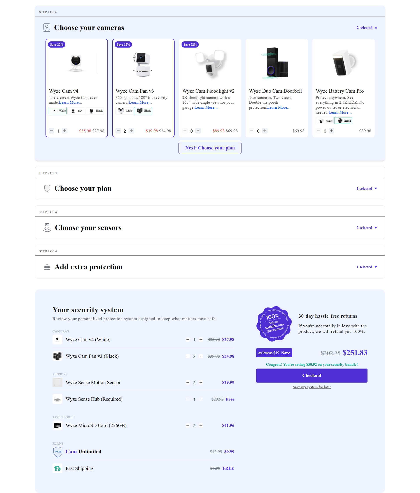
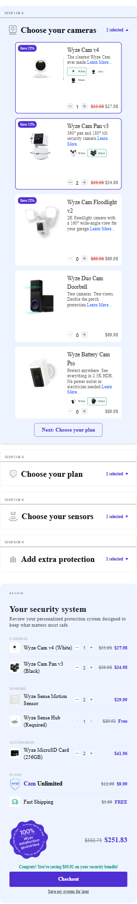

# Security System Bundle Builder

A production-style React + TypeScript application that allows users to build a custom home security bundle through a multi-step wizard while reviewing the selected products in real time.

This project was built as a frontend take-home assignment with a focus on clean architecture, reusable components, maintainability, and responsive UI.

## 🚀 Live Demo
**Frontend:** https://security-system-bundle-builder-8maw0stvc.vercel.app/
**Backend API:** https://security-system-bundle-builder.onrender.com

---

## Preview

### Desktop



### Mobile



---

## Features

- Multi-step Accordion Builder
- Live Review Panel
- Variant Selection
- Quantity Synchronization
- Dynamic Pricing
- Savings Calculation
- Fast Shipping Gift Logic
- Local Storage Persistence
- Responsive Design
- Production-ready Component Architecture

---

## Tech Stack

### Frontend

- React
- TypeScript
- Vite
- TailwindCSS
- Lucide Icons

### Backend

- Node.js
- Express
- REST API
- JSON Data

---

## Project Structure

```
frontend/
    src/
        api/
        assets/
        components/
        pages/
            BundleBuilder/
            SecuritySystem/
        services/
        utils/
```

---

## Architecture

The project follows a feature-based architecture.

```
BundleBuilder
    BundleBuilder.tsx
    types.ts
    hooks

SecuritySystem
    components
    utils
    SecuritySystem.tsx
    types.ts

CustomProductCard
    components
    hooks
    utils
    CustomProductCard.tsx
    index.ts
    types.ts

Accordion
    components
    hooks
    Accordion.tsx
    index.ts
    types.ts
```

Each feature owns:
- Components
- Business Logic
- Utilities
- Types

This keeps the project scalable and maintainable.

---

## Main Features

### Bundle Builder

- 4-step accordion
- Product cards
- Variant selector
- Quantity stepper
- Plan selection
- Responsive layout

### Security System Review

- Live synchronized review
- Quantity editing
- Pricing summary
- Savings calculation
- Fast Shipping gift
- Checkout CTA

---

## Variant Logic

Products with variants maintain independent quantities.

Example

Camera

White
Quantity = 2

Black
Quantity = 0

Switching between variants never resets quantities.

The Review Panel displays every selected variant independently.

---

## State Management

The application uses React hooks together with immutable updates.

Bundle state includes
- Cameras
- Sensors
- Plans
- Accessories

All sections stay synchronized automatically.

---

## Persistence

Configurations can be saved using Local Storage.

Saved information includes
- Product quantities
- Variant quantities
- Selected variants
- Selected plan

Reloading the application restores the previous configuration.

---

## Responsive Design

Designed for
- Desktop
- Tablet
- Mobile

The UI remains fully functional across screen sizes.

---

## Installation

Clone the repository

```bash
git clone https://github.com/maryGergisHanna/security-system-bundle-builder.git
```

Frontend

```bash
cd frontend
npm install
npm run dev
```

Backend

```bash
cd backend
npm install
node server.js
```

---

## Backend API

```
GET /api/cameras

GET /api/sensors

GET /api/plans

GET /api/accessories
```
---

## Author

Mary Gergis Hanna
Software Engineer | Frontend Developer

LinkedIn:
https://www.linkedin.com/in/mary-gergis/